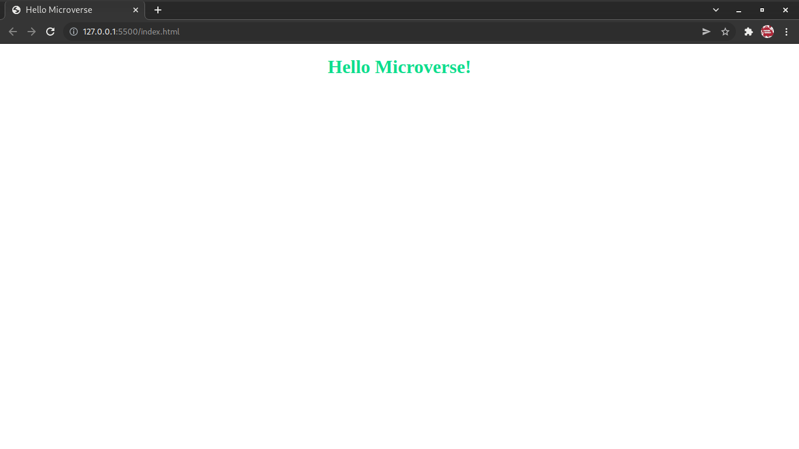

# Hello-Microverse

> Setting up linters and creating a hello-microverse page.



Additional description about the project and its features.

## Built With 

- HTML
- CSS

## Getting Started

To get a local copy up and running follow these simple example steps.

```
git clone git@github.com:Kayonga99/HELLO-Microverse.git

cd HELLO-Microverse

open in live sever
```


## Author

👤 **Olivier**

- GitHub: [@GOlivierNation](https://github.com/GOlivierNation)
- LinkedIn: [Olivier GASOMINALI](https://www.linkedin.com/in/olivier-gasominali-866962108/)


## 🤝 Contributing

Contributions, issues, and feature requests are welcome!

Feel free to check the [issues page](../../issues/).

## Show your support

Give a ⭐️ if you like this project!

## Acknowledgments

- Hat tip to anyone whose code was used
- Inspiration
- etc

## 📝 License

This project is [MIT](./MIT.md) licensed.
